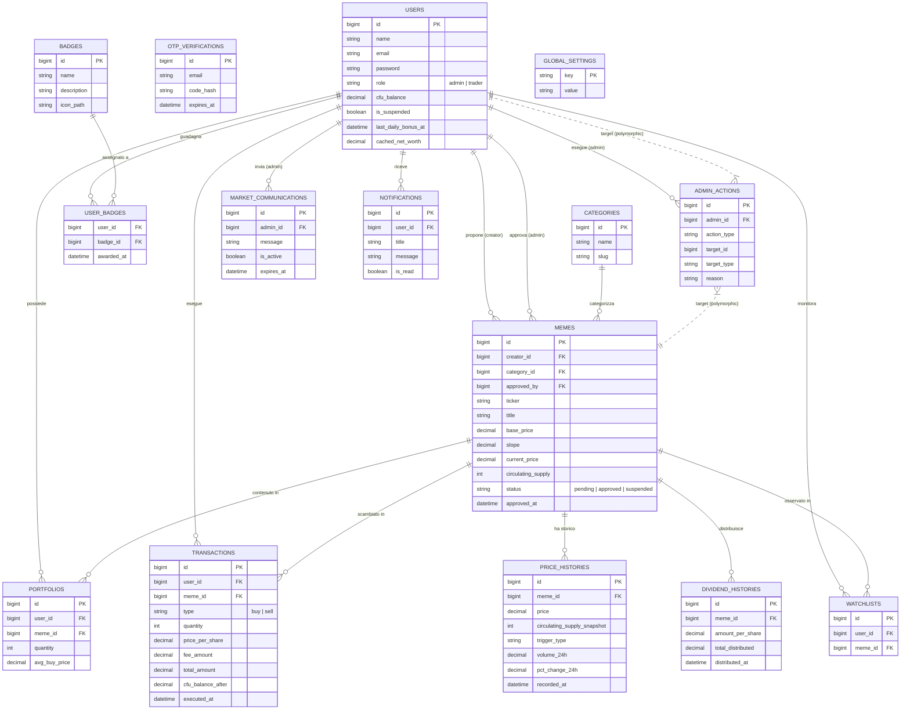

# Database Entity-Relationship Diagram

Questo diagramma rappresenta la struttura del database basata sui Model di Eloquent presenti nella directory `app/Models`.

```mermaid
erDiagram
    %% ==========================================
    %% UTENTI E AUTENTICAZIONE
    %% ==========================================
    USERS {
        bigint id PK
        string name
        string email
        string password
        string role "admin | trader"
        decimal cfu_balance
        boolean is_suspended
        datetime last_daily_bonus_at
        decimal cached_net_worth
    }

    OTP_VERIFICATIONS {
        bigint id PK
        string email
        string code_hash
        datetime expires_at
    }

    %% ==========================================
    %% MERCATO (CORE)
    %% ==========================================
    MEMES {
        bigint id PK
        bigint creator_id FK
        bigint category_id FK
        bigint approved_by FK
        string ticker
        string title
        decimal base_price
        decimal slope
        decimal current_price
        int circulating_supply
        string status "pending | approved | suspended"
        datetime approved_at
    }

    CATEGORIES {
        bigint id PK
        string name
        string slug
    }

    WATCHLISTS {
        bigint id PK
        bigint user_id FK
        bigint meme_id FK
    }

    %% ==========================================
    %% FINANZIARIO
    %% ==========================================
    PORTFOLIOS {
        bigint id PK
        bigint user_id FK
        bigint meme_id FK
        int quantity
        decimal avg_buy_price
    }

    TRANSACTIONS {
        bigint id PK
        bigint user_id FK
        bigint meme_id FK
        string type "buy | sell"
        int quantity
        decimal price_per_share
        decimal fee_amount
        decimal total_amount
        decimal cfu_balance_after
        datetime executed_at
    }

    PRICE_HISTORIES {
        bigint id PK
        bigint meme_id FK
        decimal price
        int circulating_supply_snapshot
        string trigger_type
        decimal volume_24h
        decimal pct_change_24h
        datetime recorded_at
    }

    DIVIDEND_HISTORIES {
        bigint id PK
        bigint meme_id FK
        decimal amount_per_share
        decimal total_distributed
        datetime distributed_at
    }

    %% ==========================================
    %% GAMIFICATION
    %% ==========================================
    BADGES {
        bigint id PK
        string name
        string description
        string icon_path
    }

    USER_BADGES {
        bigint user_id FK
        bigint badge_id FK
        datetime awarded_at
    }

    %% ==========================================
    %% AMMINISTRAZIONE & UTILITY
    %% ==========================================
    ADMIN_ACTIONS {
        bigint id PK
        bigint admin_id FK
        string action_type
        bigint target_id
        string target_type
        string reason
    }

    MARKET_COMMUNICATIONS {
        bigint id PK
        bigint admin_id FK
        string message
        boolean is_active
        datetime expires_at
    }

    GLOBAL_SETTINGS {
        string key PK
        string value
    }

    NOTIFICATIONS {
        bigint id PK
        bigint user_id FK
        string title
        string message
        boolean is_read
    }

    %% ==========================================
    %% RELAZIONI
    %% ==========================================
    
    %% User Relations
    USERS ||--o{ PORTFOLIOS : "possiede"
    USERS ||--o{ TRANSACTIONS : "esegue"
    USERS ||--o{ MEMES : "propone (creator)"
    USERS ||--o{ MEMES : "approva (admin)"
    USERS ||--o{ WATCHLISTS : "monitora"
    USERS ||--o{ NOTIFICATIONS : "riceve"
    USERS ||--o{ USER_BADGES : "guadagna"
    USERS ||--o{ ADMIN_ACTIONS : "esegue (admin)"
    USERS ||--o{ MARKET_COMMUNICATIONS : "invia (admin)"

    %% Meme Relations
    CATEGORIES ||--o{ MEMES : "categorizza"
    MEMES ||--o{ PORTFOLIOS : "contenuto in"
    MEMES ||--o{ TRANSACTIONS : "scambiato in"
    MEMES ||--o{ PRICE_HISTORIES : "ha storico"
    MEMES ||--o{ DIVIDEND_HISTORIES : "distribuisce"
    MEMES ||--o{ WATCHLISTS : "osservato in"

    %% Gamification Pivot
    BADGES ||--o{ USER_BADGES : "assegnato a"

    %% Admin Polymorphic (Logic Only)
    ADMIN_ACTIONS }|..|| USERS : "target (polymorphic)"
    ADMIN_ACTIONS }|..|| MEMES : "target (polymorphic)"
```
