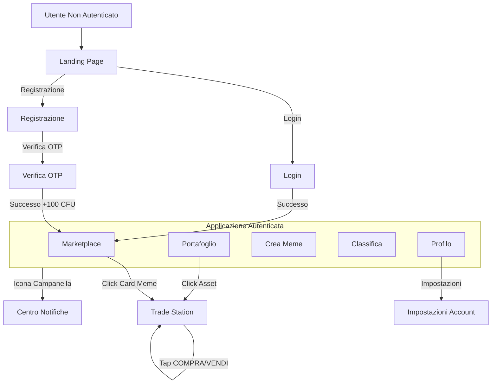

# Design Interfaccia Utente - AlmaStreet (Lato Utente)

Questo documento definisce la struttura delle pagine e il flusso di navigazione per l'applicazione AlmaStreet, adottando un approccio **Mobile-First** e seguendo gli standard delle moderne applicazioni Fintech (es. Robinhood, Revolut, Binance Lite).

---

## Flusso di Navigazione

---

## Dettaglio Pagine

### 1. Landing Page (Guest View)

**Obiettivo:** Convertire il visitatore in utente registrato tramite effetto teaser.

**Layout Mobile:**

*   **Header (Fisso in alto):**
    *   Logo AlmaStreet allineato a sinistra (altezza circa 32px).
    *   Bottone "Accedi" (Ghost style, outline leggero) allineato a destra.
    *   Sfondo semi-trasparente con backdrop blur quando si scrolla.

*   **Hero Section:**
    *   Padding verticale generoso (circa 60px top).
    *   **Titolo (H1):** "The Academic Stock Market" centrato, font size grande (28-32px), font weight bold.
    *   **Sottotitolo:** Testo descrittivo breve centrato (2 righe max), font size 16px, colore secondario (grigio chiaro).
    *   Margine verticale di separazione (24px).

*   **CTA Principale:**
    *   Bottone "Inizia a fare Trading" con colore primario (verde brillante), larghezza 80% dello schermo, altezza 48px, border-radius arrotondato (12px).
    *   Centrato orizzontalmente.
    *   Su scroll, diventa sticky (fisso) in basso con padding 16px e ombra superiore.

*   **Market Teaser (Paywall Effect):**
    *   Titolo sezione "Top Gainers" allineato a sinistra, font weight semibold.
    *   **Card Meme (Posizioni 1-3 visibili):**
        *   Layout orizzontale: Immagine Meme quadrata (64x64px) a sinistra con border-radius 8px.
        *   Contenuto centrale: Nome Meme (font weight medium), Ticker ($XXX) sotto in grigio.
        *   Grafico Sparkline minimale (linea singola verde/rossa, altezza 24px) al centro-destra.
        *   Prezzo attuale (font monospace, bold) e Badge % variazione (pill colorato verde/rosso) allineati a destra.
        *   Sfondo card leggermente elevato (subtle shadow), padding 12px, margine verticale 8px.
    *   **Posizione 4:** Card semi-trasparente con gradiente lineare dal basso (alpha 0 → 1 verso il colore di sfondo) che copre il 50% inferiore della card.
    *   **Posizione 5+:** Non renderizzate.
    *   **Conversion Block:** Subito sotto la card 4, overlay centrato con bottone "Registrati per sbloccare il mercato" (secondary color, outline style, larghezza 70%).

**Layout Desktop:**
*   Hero section centrato con max-width 1200px.
*   Market Teaser diventa griglia 2 colonne.
*   CTA principale rimane centrato ma non sticky.

---

### 2. Pagine di Autenticazione

#### 2A. Registrazione (Register Page)

**Obiettivo:** Raccogliere le credenziali e verificare l'identità istituzionale.

**Layout Mobile:**

*   **Header:**
    *   Logo centrato in alto, dimensione media (48px altezza).
    *   Padding top 40px.

*   **Form Container:**
    *   Card centrale con sfondo leggermente elevato (subtle elevation), padding 24px, border-radius 16px.
    *   **Titolo:** "Crea il tuo account" (H2, font weight bold, centrato).
    *   **Subtitle:** "Usa la tua email istituzionale" (font size 14px, grigio, centrato).

*   **Campi Input (verticali):**
    *   **Email Istituzionale:**
        *   Input field larghezza 100%, altezza 48px, border-radius 8px.
        *   Placeholder: "nome.cognome@studio.unibo.it".
        *   Icona email a sinistra dell'input.
        *   Validazione real-time: se non contiene dominio istituzionale, mostrare messaggio di errore sotto l'input (testo rosso, font size 12px).
    *   **Password:**
        *   Input type password, stesse dimensioni.
        *   Icona lucchetto a sinistra, icona "occhio" (toggle visibilità) a destra.
        *   Progress bar sotto l'input che mostra forza password (colori: rosso → giallo → verde).
    *   **Conferma Password:**
        *   Stesso stile.
        *   Validazione real-time: se non corrisponde, mostrare "Le password non corrispondono" in rosso.
    *   Margine verticale tra campi: 16px.

*   **CTA:**
    *   Bottone "Crea Account" larghezza 100%, altezza 52px, colore primario, border-radius 12px, font weight bold.
    *   Stato disabled (grigio) finché tutti i campi non sono validi.
    *   Stato loading: spinner bianco centrato nel bottone + testo "Creazione in corso...".

*   **Footer:**
    *   Link testuale centrato: "Hai già un account? Accedi" (colore primario, font size 14px).

---

#### 2B. Login Page

**Layout Mobile:**

*   Struttura identica alla registrazione, ma con solo 2 campi: Email e Password.
*   **Titolo:** "Bentornato su AlmaStreet".
*   **CTA:** "Accedi".
*   **Footer:** Link "Non hai un account? Registrati" + Link secondario "Password dimenticata?" sotto (entrambi centrati, stacked verticalmente).

---

#### 2C. Verifica OTP

**Obiettivo:** Verificare l'email tramite codice a 6 cifre.

**Layout Mobile:**

*   **Header:** Logo centrato + Bottone "Indietro" top-left.

*   **Contenuto Centrale:**
    *   Icona email grande (64px) centrata con colore primario.
    *   **Testo informativo:** "Abbiamo inviato un codice a [email@unibo.it]" (font size 16px, centrato, [email] in bold).
    *   Testo secondario sotto: "Inserisci il codice per verificare il tuo account" (font size 14px, grigio).

*   **Input Codice OTP:**
    *   6 caselle quadrate (48x48px ciascuna) affiancate orizzontalmente con gap 8px.
    *   Border spesso (2px) con colore primario quando focused.
    *   Font monospace, dimensione 24px, centrato.
    *   Auto-focus sulla prima casella.
    *   Auto-avanzamento alla casella successiva dopo inserimento cifra.
    *   Auto-submit quando tutte le 6 cifre sono inserite.

*   **Link Secondario:**
    *   "Non hai ricevuto il codice? Invia di nuovo" (centrato, font size 14px, colore primario).
    *   Countdown (es. "Riprova tra 59s") se recentemente inviato.

*   **Feedback Stati:**
    *   **Loading:** Spinner sotto le caselle durante verifica.
    *   **Errore:** Caselle diventano rosse + shake animation + messaggio "Codice errato" sotto.
    *   **Successo:** Caselle diventano verdi + checkmark animation → redirect automatico.

---

#### 2D. Onboarding Bonus (Modal/Page)

**Obiettivo:** Celebrare l'iscrizione e informare del bonus iniziale.

**Layout Mobile:**

*   **Sfondo:** Overlay scuro semi-trasparente (alpha 0.8) su fullscreen.

*   **Modal Centrato:**
    *   Card con sfondo solido, border-radius 24px, padding 32px.
    *   **Animazione:** Confetti animation che parte dal centro e esplode verso i bordi (libreria tipo canvas-confetti).
    *   **Icona:** Emoji 🎉 o icona moneta grande (80px) centrata.
    *   **Titolo:** "Benvenuto su AlmaStreet!" (H2, bold, centrato).
    *   **Messaggio:** "Ecco il tuo bonus di benvenuto:" (font size 16px, centrato).
    *   **Importo:** "100 CFU" (font size 48px, colore primario, font weight black, centrato).
    *   **Descrizione breve:** "Usa questi CFU per iniziare a fare trading sui meme più caldi dell'ateneo!" (font size 14px, grigio, centrato).

*   **CTA:**
    *   Bottone "Vai al Mercato" larghezza 100%, altezza 52px, colore primario, border-radius 12px.
    *   Pressione → Chiusura modal + redirect a Marketplace.

---

### 3. App Shell (Layout Principale Autenticato)

**Obiettivo:** Struttura persistente che contiene tutte le pagine dell'applicazione autenticata.

**Layout Mobile:**

*   **Top Bar (Sticky, altezza 56px):**
    *   Sfondo con leggera trasparenza e backdrop blur.
    *   **Sinistra:** Titolo App con logo.
    *   **Centro:** Saldo utente corrente.
        *   Importo "1,250.00 CFU" (font size 18px, font weight bold, font monospace, colore bianco/primario).
    *   **Destra:** Icona campanella notifiche (24x24px).
        *   Badge rosso circolare con numero notifiche non lette (se presenti), posizionato top-right dell'icona.
        *   Tap → Apre pannello notifiche da destra.

*   **Bottom Navigation Bar (Sticky, altezza 64px):**
    *   5 tab items con layout orizzontale equidistanziato.
    *   **Struttura singolo item:**
        * Icona (24x24px) centrata.
        * Label sotto l'icona (font size 10px).
        * Stato attivo: Icona + label colore primario, indicatore sottile (2px) sopra l'icona.
        * Stato inattivo: Icona + label colore grigio.
    *   **Ordine da sinistra a destra:**
        1. **Market** (icona grafico/trending).
        4. **Classifica** (icona trofeo/podio).
        3. **(+)** (bottone centrale sopraelevato - vedi sotto).
        2. **Portafoglio** (icona wallet).
        5. **Profilo** (icona user/avatar).
    *   **Bottone Centrale "(+)":**
        * Bottone circolare (56x56px) elevato di 8px sopra la bottom bar.
        * Sfondo colore primario con gradiente.
        * Icona "+" bianca centrata (32x32px).
        * Ombra pronunciata (elevation 8).
        * Border bianco sottile (2px) per staccare dallo sfondo.

*   **Content Area:**
    * Occupa lo spazio tra Top Bar e Bottom Bar.
    * Scroll verticale indipendente.
    * Background colore scuro (se dark mode).

**Layout Desktop/Tablet:**

*   **Top Navbar orizzontale (altezza 72px):**
    *   Logo AlmaStreet a sinistra.
    *   Menu items orizzontale al centro: Market | Portafoglio | **Crea Meme** (enfatizzato) | Classifica | Profilo.
    *   Saldo utente + icona notifiche a destra.
*   Bottom Bar non presente.
*   Content area full height sotto la navbar.

---

### 4. Centro Notifiche (Notification Panel)

**Obiettivo:** Mostrare comunicazioni di sistema, dividendi ricevuti, aggiornamenti di mercato e messaggi del Rettorato.

**Interazione:**
*   Apertura: Slide-in da destra su tap icona campanella (mobile) o dropdown da top-bar (desktop).
*   Chiusura: Tap fuori dal pannello, tap su "X", o swipe verso destra (mobile).

**Layout Mobile (Aside laterale):**

*   **Container:**
    *   Larghezza 85% dello schermo (max 320px).
    *   Altezza 100vh.
    *   Sfondo solido (dark mode: grigio scuro 900).
    *   Animazione slide da destra con easing smooth.
    *   Overlay scuro (alpha 0.5) copre il resto dello schermo.

*   **Header (Fisso in alto, altezza 64px):**
    *   Titolo "Notifiche" (font weight bold, font size 20px) allineato a sinistra.
    *   Bottone "X" (chiudi) allineato a destra (icona 24x24px).
    *   Bottone secondario "Segna tutte come lette" (testo piccolo, colore primario) sotto il titolo (font size 12px).
    *   Border bottom sottile.

*   **Lista Notifiche (Scroll verticale):**
    *   Padding 16px.
    *   **Card Notifica:**
        *   Sfondo leggermente diverso se non letta (grigio 800) vs letta (grigio 850).
        *   Border-radius 8px.
        *   Padding 12px.
        *   Margine bottom 12px.
        *   **Struttura interna:**
            *   **Icona sinistra:** Icona specifica per tipo notifica (24x24px):
                *   💰 Dividendo ricevuto (colore verde).
                *   📢 Comunicazione Rettorato (colore blu).
                *   ✅ Transazione completata (colore verde).
                *   ❌ Errore transazione (colore rosso).
                *   🆕 Nuovo meme approvato (colore giallo).
            *   **Contenuto centrale:**
                *   **Titolo** (font weight semibold, font size 14px).
                *   **Messaggio** (font size 13px, grigio chiaro, max 2 righe con ellipsis).
                *   **Timestamp** (font size 11px, grigio, es. "5 min fa").
            *   **Indicator destro:** Pallino blu (8px) se non letta, posizionato top-right.
        *   **Tap su card:** Marca come letta + eventuale azione (es. se è notifica dividendo, può portare al meme correlato).

*   **Stato Vuoto:**
    *   Se nessuna notifica: Icona campanella grande (64px) centrata con colore grigio + testo "Nessuna notifica" sotto.

*   **Comunicazione Rettorato (Speciale):**
    *   Se presente, viene mostrata come **banner sticky** in cima alla lista (sempre visibile anche scrollando).
    *   Sfondo colore distintivo (es. blu scuro con bordo blu brillante).
    *   Icona megafono 📢 a sinistra.
    *   Testo messaggio (può essere multi-riga).
    *   **NON** ha timestamp né può essere chiusa dall'utente (solo l'admin può rimuoverla).

**Layout Desktop:**
*   Pannello dropdown da top-bar (larghezza fissa 360px).
*   Altezza massima 480px con scroll interno.
*   Stessa struttura interna.
---

### 5. Marketplace (Home Tab)

**Obiettivo:** Discovery, FOMO, rapido accesso ai meme popolari.

**Layout Mobile:**

*   **Ticker Tape (Marquee scorrevole, altezza 40px):**
    *   Subito sotto la Top Bar.
    *   Sfondo colore distintivo (es. grigio 800 con bordo sottile).
    *   Testo scorrevole da destra a sinistra in loop infinito.
    *   Contenuto: "$DOGE +12.5% • $PIKA -3.2% • $STONK +45.8% •" (ripetuto).
    *   Font monospace, dimensione 14px.
    *   Colore testo verde se positivo, rosso se negativo.
    *   Velocità moderata (circa 40px/sec).

*   **Filtri (Chips orizzontali scorrevoli, altezza 48px):**
    *   Subito sotto il ticker.
    *   Scroll orizzontale (hide scrollbar).
    *   Padding orizzontale 16px.
    *   **Chip singolo:**
        *   Pillola con border-radius 20px, padding 8px 16px.
        *   Sfondo grigio se inattivo, colore primario se attivo.
        *   Testo: "Tutti", "🔥 Top Gainer", "🆕 New Listing", "⚠️ High Risk".
        *   Tap → Filtra il feed sottostante + animazione smooth.

*   **Meme Feed (Lista verticale, scroll infinito):**
    *   Padding laterale 16px.
    *   **Card Meme (stile Instagram feed):**
        *   Margine bottom 16px.
        *   Border-radius 12px pronunciato.
        *   Sfondo elevato (grigio 850).
        *   **Header Card:**
            *   Avatar Creatore (32x32px, circolare ritagliato) allineato a sinistra.
            *   Titolo: nome meme (font size 14px, font weight medium).
            *   Sottotitolo: ticker "$XXX" (font size 12px, grigio).
            *   Badge status "New" o "Pending" se applicabile (piccolo, top-right).
        *   **Media (Immagine Meme):**
            *   Full width della card.
            *   Aspect ratio originale preservato (o constraint max-height 400px).
            *   Border-radius solo top se no header, altrimenti no radius.
            *   Tap → Naviga a Trade Station.
        *   **Info Bar:**
            *   Layout orizzontale con spazio distribuito.
            *   **Sinistra:**
                *   Prezzo attuale (font monospace, font size 24px, font weight bold).
                *   Sotto: "Prezzo" (font size 10px, grigio).
            *   **Destra:**
                *   Badge variazione 24h (pill colorato):
                    *   Background verde se positivo, rosso se negativo.
                    *   Testo: "+12.5%" o "-3.2%" (font size 14px, font weight semibold).
                    *   Icona freccia ↑ o ↓ prima del numero.
            *   **Centro in basso:**
                *   Bottone "Trade" (outline style, colore primario, border-radius 8px, padding 8px 20px).
                *   Tap → Naviga a Trade Station.

*   **Skeleton Loading:**
    *   Quando si carica la pagina o si applica un filtro: mostrare 3-4 card skeleton grigie pulsanti con stessa struttura.

**Layout Desktop:**
*   Feed diventa griglia 2-3 colonne.
*   Card mantengono stessa struttura ma aspect ratio più controllato.

---

### 6. Trade Station (Dettaglio Meme & Operatività)

**Obiettivo:** Fornire analisi completa del meme e permettere trading sicuro e consapevole.

**Layout Mobile (Scroll verticale):**

*   **Header Navigazione (Sticky, altezza 56px):**
    *   Bottone "Indietro" (icona chevron-left) a sinistra.
    *   Ticker "$DOGE" centrato (font weight bold, font size 18px).
    *   Icona stella (outline) a destra per futura watchlist (disabilitata per ora).
    *   Sfondo con backdrop blur.

*   **Blocco 1: Prezzo Hero (padding 24px):**
    *   **Prezzo Corrente:** Font size 48px, font weight black, font monospace, centrato.
    *   Colore dinamico: Verde se variazione positiva, Rosso se negativa, Bianco se neutro.
    *   **Variazione Sotto:**
        *   Riga con layout orizzontale centrato.
        *   Freccia ↑/↓ (16px).
        *   Variazione assoluta "+2.35 CFU" (font size 16px, font weight medium).
        *   Separator "•".
        *   Variazione percentuale "+12.5%" (font size 16px, font weight medium).
        *   Stesso colore del prezzo.

*   **Blocco 2: Visualizzazione Dati (Switch View - "L'altra faccia della medaglia"):**
    *   **Toggle Selector (altezza 40px, centrato):**
        *   Segmented control con 2 opzioni: "Grafico 📊" | "Meme 🖼️".
        *   Larghezza 60% dello schermo, border-radius 12px.
        *   Opzione attiva: sfondo primario, testo bianco.
        *   Opzione inattiva: sfondo trasparente, testo grigio.
        *   Animazione smooth dello sfondo quando si cambia.
        *   **Tap sul toggle → Alterna tra le due viste.**
    *   **Area di Visualizzazione (altezza dinamica, min 300px):**
        *   **Vista Grafico (default):**
            *   Chart interattivo (TradingView Lightweight Charts o Chart.js).
            *   Tipo: Candlestick o linea (configurabile).
            *   Assi minimali su mobile (nascondi gridlines excessive).
            *   **Selettori time-frame sotto il grafico:**
                *   Chips orizzontali: "1H" | "1D" | "1W" | "ALL".
                *   Chip attivo colorato primario.
                *   Tap → Ricarica dati grafico per quel periodo.
        *   **Vista Meme (alternativa):**
            *   **Immagine meme:** Centrata, max-width 100%, max-height 300px, aspect ratio preservato.
            *   Background sfumato se immagine non copre tutta l'area.
            *   **Informazioni sotto l'immagine (padding 16px):**
                *   **Nome completo meme:** Font size 20px, font weight bold.
                *   **Categoria:** Badge pill (es. "Reaction", "Animali") con colore distintivo.
                *   **Creatore:** Layout orizzontale con avatar circolare (32px) + nickname (font size 14px, grigio).
                *   **Data IPO:** "Quotato il GG/MM/AAAA" (font size 12px, grigio).
                *   **Descrizione:** Testo multi-riga (se presente), font size 14px, line-height 1.5, max 4 righe con "Leggi tutto" se troncato.
        *   **Gesture (opzionale):** Swipe left/right per alternare tra le due viste.

*   **Blocco 3: Statistiche Chiave (padding 16px):**
    *   **Visibile solo in Vista Grafico.**
    *   Griglia 2x2 con gap 12px.
    *   **Card Statistica singola:**
        *   Background grigio 850, border-radius 8px, padding 12px.
        *   Label sopra (font size 12px, grigio): "Market Cap", "Volume 24h", "Supply", "Rischio".
        *   Valore sotto (font size 18px, font weight bold): es. "1,250 CFU", "350 CFU", "500 azioni", "Alto ⚠️".
        *   Colore valore: Bianco per dati neutri, Rosso per rischio alto, Verde per rischio basso.
    *   **Nota:** Quando si attiva la Vista Meme, questo blocco viene nascosto e sostituito dalle informazioni testuali del meme (già incluse nella Vista Meme del Blocco 2).

*   **Sticky Footer: Barra Azioni Trading (altezza 72px, sempre visibile in basso):**
    *   Sfondo solido (grigio 900), border-top sottile.
    *   Due bottoni affiancati con gap 12px, padding laterale 16px.
    *   **Bottone VENDI (50% width - 6px):**
        *   Altezza 56px, border-radius 12px.
        *   Background rosso (o outline rosso se non possiede azioni).
        *   Testo "VENDI" (font weight bold, uppercase).
        *   **Stato disabled:** Grigio con opacità 0.5 se l'utente non possiede azioni del meme.
        *   Tap → Apre Bottom Sheet Vendita.
    *   **Bottone COMPRA (50% width - 6px):**
        *   Altezza 56px, border-radius 12px.
        *   Background verde primario.
        *   Testo "COMPRA" (font weight bold, uppercase).
        *   Tap → Apre Bottom Sheet Acquisto.

**Layout Desktop:**
*   Layout a 2 colonne: Grafico + Stats a sinistra (70%), Info + Azioni a destra (30%).

---

### 7. Bottom Sheet Trading (Acquisto/Vendita)

**Obiettivo:** Interfaccia sicura, intuitiva e veloce per eseguire operazioni di trading.

**Interazione:**
*   Apertura: Slide-up dal basso quando si preme COMPRA o VENDI nella Trade Station.
*   Chiusura: Tap fuori dall'area, swipe down, o tap su icona "X".
*   Comportamento: Modal che copre circa 60% dello schermo (mobile), con backdrop scuro (alpha 0.6).

**Layout Mobile (Bottom Sheet Acquisto):**

*   **Container:**
    *   Border-radius 24px solo top.
    *   Sfondo solido (grigio 900).
    *   Padding 24px.
    *   Handle bar (maniglia) centrato in alto: linea orizzontale grigia (40px width, 4px height, border-radius 2px).

*   **Header (altezza 64px):**
    *   **Titolo:** "Acquista $DOGE" (font size 20px, font weight bold).
    *   **Sottotitolo:** "Prezzo attuale:".
    *   **Saldo Disponibile sotto:** "Saldo: 850.00 CFU" con icona portafoglio e sfondo piu scuro (font size 14px, grigio, font monospace).

*   **Input Quantità (focus area centrale):**
    *   Label: "Quantità azioni" (font size 12px, grigio, uppercase).
    *   **Input Field gigante:**
        * Altezza 72px, border-radius 12px.
        * Border colore primario quando focused.
        * Font size 36px, font weight bold, font monospace, centrato.
        * Placeholder: "0".
        * Tastiera numerica auto-aperta (type="number" con attributo inputmode="decimal").
    *   **Valore Stimato sotto input:**
        * Testo: "≈ 50.20 CFU" (font size 16px, grigio, font monospace).
        * Aggiornamento in tempo reale mentre l'utente digita.

*   **Shortcuts Percentuali (altezza 48px):**
    * 4 bottoni affiancati con gap 8px: "25%" | "50%" | "75%" | "MAX".
    * Stile outline, border-radius 8px, padding 12px.
    * Tap → Auto-compila il campo quantità in base al saldo disponibile.
    * "MAX" → Calcola quante azioni si possono comprare con tutto il saldo (considerando il prezzo crescente per la bonding curve).

*   **Riepilogo Costi (Accordion, chiuso di default):**
    * Tap su "Dettagli costi ▼" → Espande.
    * **Contenuto espanso:**
        * Riga: "Prezzo medio stimato" | "2.45 CFU" (font monospace).
        * Riga: "Slippage stimato" | "0.15 CFU (0.5%)" (colore giallo se >2%).
        * Riga: "Fee segreteria (2%)" | "1.00 CFU".
        * Separator line.
        * **Riga totale (bold):** "Costo totale" | "51.20 CFU".

*   **CTA Principale (Bottone conferma):**
    *   Larghezza 100%, altezza 56px, border-radius 12px.
    *   Background verde primario.
    *   Testo: "Conferma Acquisto" (font weight bold, uppercase).
    *   **Stati:**
        *   **Disabled:** Grigio con opacità 0.5 se quantità = 0 o saldo insufficiente.
        *   **Loading:** Spinner bianco + testo "Elaborazione...".
        *   **Slippage Protection:** Se il prezzo cambia durante la preview, bottone diventa giallo con testo "Prezzo aggiornato - Conferma di nuovo" (vedi Modal Slippage sotto).

**Layout Mobile (Bottom Sheet Vendita):**

*   **Identico al Bottom Sheet Acquisto** con le seguenti differenze:
    *   Titolo: "Vendi $DOGE".
    *   Sotto titolo: "Posizione: 120 azioni" (mostra quante azioni possiede).
    *   Input placeholder: max = quantità posseduta.
    *   Shortcuts: "25%" | "50%" | "75%" | "TUTTO".
    *   Valore stimato: "≈ 48.50 CFU" (incasso stimato).
    *   Riepilogo mostra "Incasso totale" invece di "Costo totale".
    *   Bottone conferma: Background rosso, testo "Conferma Vendita".

---

### 8. Pop-up Slippage Protection

**Obiettivo:** Informare l'utente che il prezzo è cambiato significativamente durante la preparazione dell'ordine e che deve rivedere i dati aggiornati.

**Quando compare:**
*   Dopo aver premuto "Conferma Acquisto/Vendita" nel Bottom Sheet, se il server rileva che il prezzo è cambiato di oltre una soglia (es. ±2%) rispetto al prezzo visualizzato.

**Layout Mobile (Modal centrato):**

*   **Overlay scuro (alpha 0.8) fullscreen.**

*   **Card Modal centrata:**
    *   Larghezza 85% schermo (max 320px).
    *   Border-radius 16px.
    *   Sfondo grigio 900.
    *   Padding 24px.

*   **Icona Alert (top, centrata):**
    *   Icona triangolo warning ⚠️ (48px, colore giallo/arancione).

*   **Titolo:**
    *   "Prezzo cambiato!" (font size 20px, font weight bold, centrato).

*   **Messaggio esplicativo:**
    *   "Il prezzo del meme è variato mentre preparavi l'ordine. Controlla i nuovi valori e riprova." (font size 14px, grigio, centrato).

*   **Confronto Prezzi (Box evidenziato):**
    *   Background grigio 800, border-radius 8px, padding 16px, margine verticale 16px.
    *   **Riga 1:** "Prezzo iniziale: 2.45 CFU" (font monospace, grigio).
    *   **Riga 2:** "Prezzo attuale: 2.67 CFU" (font monospace, colore verde/rosso in base a direzione).
    *   **Riga 3:** "Variazione: +0.22 CFU (+9.0%)" (font weight bold, colore dinamico).

*   **Azione (bottone singolo):**
    *   **Bottone Primario:** "Ho capito" (colore primario, altezza 48px, larghezza 100%, border-radius 12px).
        *   Tap → Chiude il modal e torna al Bottom Sheet Trading con i dati ricalcolati (prezzi aggiornati, totale ricalcolato).

**Note:**
*   Se lo slippage è molto elevato (es. >10%), il messaggio diventa più critico: "⚠️ ATTENZIONE: Grande variazione di prezzo rilevata!".
*   Questo modal è puramente informativo: l'utente deve chiuderlo e poi rivedere i nuovi dati nella Trade Station prima di tentare nuovamente l'operazione.
*   Dopo la chiusura, il Bottom Sheet rimane aperto con la quantità inserita mantenuta, ma tutti i valori (prezzo, totale, fees) vengono ricalcolati automaticamente in base al nuovo prezzo di mercato.
---

### 9. Toast Notifications (Feedback Transazioni)

**Obiettivo:** Fornire feedback immediato non invasivo sugli esiti delle operazioni.

**Quando compaiono:**
*   Dopo esecuzione transazione (successo o errore).
*   Dopo ricezione dividendo (se utente online).
*   Dopo azioni di sistema (es. meme approvato che l'utente ha creato).

**Layout Mobile:**

*   **Posizione:** Top dello schermo (sotto la Top Bar) o bottom (sopra la Bottom Bar) - preferibile top per visibilità.

*   **Container Toast:**
    *   Larghezza 90% schermo (max 360px), centrato orizzontalmente.
    *   Altezza auto (min 64px), padding 16px.
    *   Border-radius 12px.
    *   Background con sfumatura in base al tipo:
        *   **Successo:** Verde scuro con border verde brillante.
        *   **Errore:** Rosso scuro con border rosso brillante.
        *   **Info:** Blu scuro con border blu brillante.
    *   Ombra pronunciata (elevation 8).
    *   **Animazione ingresso:** Slide down da top con bounce.
    *   **Animazione uscita:** Fade out + slide up (dopo 3-4 secondi).

*   **Struttura interna (layout orizzontale):**
    *   **Icona sinistra (32x32px):**
        *   ✅ Successo (verde).
        *   ❌ Errore (rosso).
        *   ℹ️ Info (blu).
    *   **Contenuto centrale:**
        *   **Titolo (font size 14px, font weight semibold):** Es. "Ordine Eseguito", "Errore Transazione", "Dividendo Ricevuto".
        *   **Messaggio (font size 12px, grigio chiaro):** Es. "+10 azioni $DOGE", "Saldo insufficiente", "+5.50 CFU da $PIKA".
    *   **Bottone chiudi destro (opzionale):** Icona "X" piccola (16px) per chiusura manuale.

*   **Interazione:**
    *   Tap sul toast → Può eseguire azione contestuale (es. se è notifica dividendo, apre Trade Station del meme).
    *   Swipe up (se top) o swipe down (se bottom) → Chiusura anticipata.

**Esempi Messaggi:**
*   **Acquisto successo:** "Ordine Eseguito | +25 azioni $DOGE per 62.50 CFU".
*   **Vendita successo:** "Vendita Completata | -50 azioni $PIKA, incassati 123.40 CFU".
*   **Errore saldo:** "Errore | Saldo insufficiente per completare l'operazione".
*   **Dividendo:** "Dividendo Ricevuto 💰 | +12.50 CFU da $STONK".

---

### 10. Portafoglio (Dashboard Personale)

**Obiettivo:** Strumento di analisi finanziaria personale, non un profilo social.

**Layout Mobile (Scroll verticale):**

*   **Hero Section (padding 24px, background con gradiente primario):**
    *   **Net Worth (Patrimonio Totale):**
        *   Label "Il Mio Patrimonio" (font size 14px, grigio chiaro, uppercase).
        *   Valore "1,350.75 CFU" (font size 42px, font weight black, font monospace, bianco).
        *   **Icona eye (toggle):** Possibilità di nascondere il valore (mostra "•••••" quando hidden).
    *   **PNL Giornaliero (sotto il Net Worth):**
        *   Badge pill orizzontale.
        *   Background verde se positivo, rosso se negativo.
        *   Icona freccia ↑/↓.
        *   Testo: "Oggi: +120.50 CFU (+9.8%)" (font size 14px, font weight semibold).

*   **Chart Asset Allocation (padding 16px):**
    *   Titolo "Allocazione Patrimonio" (font size 16px, font weight semibold).
    *   **Grafico Donut (Chart.js):**
        *   Dimensione 200x200px centrata.
        *   2 sezioni: Liquidità (colore verde) e Investito (colore blu).
        *   Centro del donut mostra percentuale investita (es. "65%").
    *   **Legenda sotto il grafico:**
        *   Riga 1: 🟢 Liquidità | "450.00 CFU (35%)".
        *   Riga 2: 🔵 Investito | "900.75 CFU (65%)".

*   **Lista Asset (Holdings):**
    *   Titolo "Le Mie Posizioni" (font size 16px, font weight semibold, padding 16px).
    *   **Card singola posizione:**
        *   Altezza 72px, padding 12px, background grigio 850, border-radius 8px, margine bottom 12px.
        *   Layout orizzontale:
            *   **Sinistra:** Miniatura meme circolare (48px) + Ticker "$DOGE" sotto (font size 12px, grigio).
            *   **Centro:**
                *   Q.tà posseduta "120 azioni" (font size 14px, font weight medium).
                *   Valore attuale "294.00 CFU" (font size 16px, font monospace).
            *   **Destra:**
                *   PNL posizione "+24.50 CFU" (colore verde/rosso, font size 14px, font weight bold).
                *   PNL percentuale "(+9.1%)" sotto (font size 12px).
        *   **Tap su card:** Naviga alla Trade Station del meme.

*   **Stato Vuoto (se nessuna posizione):**
    *   Icona portfolio grande (64px, grigio).
    *   Testo "Nessuna posizione aperta" (centrato).
    *   Bottone "Esplora il Mercato" → Naviga a Marketplace.

**Note:**
*   Il Net Worth è calcolato come: Saldo Liquido + Σ(Quantità Azioni * Prezzo Corrente).
*   La lista è ordinata per valore decrescente di default.
*   **Pull-to-refresh** aggiorna prezzi e PNL.

---

### 11. Crea Meme (IPO / Listing)

**Obiettivo:** Permettere agli utenti di proporre nuovi meme al mercato pagando la listing fee.

**Layout Mobile (Scroll verticale):**

*   **Header:**
    *   Bottone "Indietro" a sinistra.
    *   Titolo "Proponi un Meme" centrato.

*   **Info Banner (top):**
    *   Box informativo con background blu scuro, border blu, border-radius 8px, padding 12px.
    *   Icona info ℹ️ a sinistra.
    *   Testo: "Costo listing: 20 CFU • Il tuo meme sarà visibile subito, trading disponibile dopo approvazione".

*   **Upload Area (padding 24px):**
    *   **Box Upload:**
        *   Altezza 240px, border tratteggiato (2px, grigio 600), border-radius 12px.
        *   Background grigio 850.
        *   **Stato vuoto:**
            *   Icona upload (48px, grigio) centrata.
            *   Testo "Tocca per caricare un meme" (font size 14px, grigio, centrato).
            *   Tap → Apre file picker (accept: image/*).
        *   **Stato con immagine:**
            *   Preview immagine caricata (contain, max 100% width/height).
            *   Bottone "Cambia" (outline, piccolo) nell'angolo top-right.

*   **Form Dati (padding 16px):**
    *   **Campo Titolo Meme:**
        *   Label "Titolo del Meme" (font size 12px, grigio, uppercase).
        *   Input text, altezza 48px, border-radius 8px.
        *   Placeholder: "es. Surprised Pikachu".
        *   Counter caratteri "0/50" sotto input (font size 11px, grigio).
    *   **Campo Ticker (auto-generato o manuale):**
        *   Label "Ticker" (font size 12px, grigio, uppercase).
        *   Input text, altezza 48px, border-radius 8px.
        *   Placeholder: "$PIKA" (auto-generato dal titolo).
        *   Prefix "$" fisso a sinistra dell'input.
        *   Validazione: max 6 caratteri, solo lettere, uppercase auto.
        *   Messaggio sotto: "Sarà univoco e verificato" (font size 11px, grigio).
    *   **Campo Categoria:**
        *   Label "Categoria" (font size 12px, grigio, uppercase).
        *   Select dropdown, altezza 48px, border-radius 8px.
        *   Opzioni: "Reaction", "Animali", "Università", "Politica", "Sport", "Altro".
        *   Icona chevron-down a destra.

*   **Riepilogo Costi (padding 16px):**
    *   Card con background grigio 800, border-radius 8px, padding 16px.
    *   **Riga 1:** "Costo Listing" | "20.00 CFU" (font monospace).
    *   **Riga 2:** "Tuo saldo attuale" | "450.00 CFU" (font monospace).
    *   Separator line.
    *   **Riga 3 (bold):** "Saldo dopo listing" | "430.00 CFU".
    *   **Warning (se saldo insufficiente):**
        *   Box rosso sotto, icona ⚠️, testo "Saldo insufficiente".

*   **CTA Principale:**
    *   Bottone "Paga e Invia al Rettorato" (verde primario, larghezza 90%, altezza 56px, border-radius 12px, centrato).
    *   **Stati:**
        *   Disabled se: immagine mancante, titolo vuoto, ticker vuoto, categoria non selezionata, o saldo insufficiente.
        *   Loading: spinner + testo "Invio in corso...".
        *   Successo: Toast "Meme inviato con successo!" → Redirect a Marketplace o a pagina conferma.

*   **Note sotto CTA (font size 11px, grigio, centrato):**
    *   "La fee non è rimborsabile. Il meme sarà controllato dall'admin."

**Validazioni:**
*   Immagine: max 10MB, formati JPG/PNG/GIF.
*   Titolo: min 3 caratteri, max 50.
*   Ticker: min 3, max 6, univoco (verifica backend).

---

### 12. Classifica (Leaderboard)

**Obiettivo:** Gamification e competizione tra utenti.

**Layout Mobile (Scroll verticale):**

*   **Header Section (padding 24px, background con gradiente):**
    *   Titolo "Dean's List" (font size 24px, font weight bold, centrato).
    *   Sottotitolo "I migliori trader dell'ateneo" (font size 14px, grigio chiaro, centrato).

*   **Podio Top 3 (altezza 200px, padding 16px):**
    *   Layout orizzontale con 3 posizioni.
    *   **Disposizione:**
        *   **Centro (1° posto):** Posizione più elevata.
        *   **Sinistra (2° posto):** Leggermente più basso del 1°.
        *   **Destra (3° posto):** Leggermente più basso del 2°.
    *   **Struttura singola posizione podio:**
        *   Avatar utente circolare (64px per 1°, 56px per 2° e 3°).
        *   Badge posizione (es. 🥇 1°) sovrapposto top-center dell'avatar.
        *   Nickname sotto avatar (font size 14px, font weight semibold, troncato se lungo).
        *   Net Worth sotto nickname (font size 16px, font monospace, colore primario).
        *   Background della card: gradiente oro per 1°, argento per 2°, bronzo per 3°.

*   **Lista Dal 4° in Poi (padding 16px):**
    *   **Card singola posizione:**
        *   Altezza 64px, padding 12px, background grigio 850, border-radius 8px, margine bottom 8px.
        *   Layout orizzontale:
            *   **Sinistra:** Numero posizione "4" (font size 20px, font weight bold, width 32px, centrato).
            *   **Centro-Sx:** Avatar circolare (40px).
            *   **Centro:** Nickname (font size 14px, font weight medium).
            *   **Destra:** Net Worth (font size 16px, font monospace, colore grigio chiaro).
        *   **Evidenziazione utente corrente:**
            *   Se la card rappresenta l'utente loggato: border colore primario (2px), background leggermente più chiaro.

*   **Posizione Utente Corrente (Sticky Bottom):**
    *   Se l'utente non è nei top 10 visibili, mostrare card sticky in basso con la sua posizione.
    *   Background grigio 900, border-top, altezza 64px.
    *   Stesso layout delle card lista, ma con border primario.
    *   Testo: "La tua posizione: #47" (piccolo, sopra la card).

*   **Filtri (opzionali, top della lista):**
    *   Chips: "Tutti" | "Questa Settimana" | "Questo Mese".
    *   Filtrano la classifica per periodo.

*   **Stato Vuoto:**
    *   Se non ci sono dati: Icona trofeo grigia + "Nessun trader ancora".

**Note:**
*   Aggiornamento dati: pull-to-refresh o auto-refresh ogni 30 secondi.
*   Possibilità di tap su utente per vedere profilo pubblico (feature futura).

---

### 13. Profilo Utente

**Obiettivo:** Dashboard personale con informazioni account, badge e accesso alle impostazioni.

**Layout Mobile (Scroll verticale):**

*   **Header Profilo (padding 24px, background con gradiente primario):**
    *   **Avatar:**
        *   Immagine circolare grande (96px) centrata.
        *   Border bianco (3px).
        *   Tap → Futura modifica avatar.
    *   **Nickname:**
        *   Sotto avatar, font size 22px, font weight bold, centrato.
        *   Tap → Futura modifica nickname.
    *   **Email:**
        *   Sotto nickname, font size 13px, grigio chiaro, centrato.
    *   **Badges:**
        *   Riga orizzontale scorrevole di badge ottenuti (max 5 visibili).
        *   Badge singolo: Icona 32x32px con tooltip nome al tap.
        *   Es: 💎 Diamond Hands, 🎯 IPO Hunter, 📉 Liquidator.
        *   Se nessun badge: Testo "Nessun badge ottenuto" (grigio, piccolo).

*   **Statistiche Rapide (Griglia 2x2, padding 16px):**
    *   **Card singola statistica:**
        *   Background grigio 850, border-radius 8px, padding 16px.
        *   Layout verticale:
            *   Label sopra (font size 12px, grigio, uppercase): "Iscritto da", "Trade totali", "Miglior Trade", "Posizione".
            *   Valore sotto (font size 20px, font weight bold): "15 giorni", "47", "+120.50 CFU", "#12".

*   **Menu Opzioni (Lista, padding 16px):**
    *   **Item singolo:**
        *   Altezza 56px, padding 16px, background grigio 850, border-radius 8px, margine bottom 8px.
        *   Layout orizzontale:
            *   Icona sinistra (24px): ⚙️ Impostazioni, 🔔 Notifiche (con counter badge), 📊 Attività.
            *   Testo centrale (font size 15px, font weight medium).
            *   Chevron-right destra (16px, grigio).
        *   Tap → Naviga alla pagina corrispondente.
    *   **Opzioni disponibili:**
        1. **Impostazioni Account** → Pagina Impostazioni.
        2. **Centro Notifiche** (con badge numero non lette) → Apre pannello notifiche.
        3. **Logout** (testo rosso, icona 🚪) → Modal conferma → Logout.

*   **Versione App (footer, centrato):**
    *   Testo piccolo (font size 11px, grigio): "AlmaStreet v1.0.0".

**Note:**
*   Il profilo è personale, non pubblico (per ora).
*   Badge vengono assegnati automaticamente dal backend in base a milestone raggiunti.

---

### 14. Impostazioni Account

**Obiettivo:** Gestione delle preferenze utente e azioni critiche sull'account.

**Layout Mobile (Scroll verticale):**

*   **Header:**
    *   Bottone "Indietro" a sinistra.
    *   Titolo "Impostazioni" centrato.

*   **Sezioni (gruppi separati):**

    **A. Profilo Personale:**
    *   Titolo sezione "Profilo" (font size 14px, grigio, uppercase, padding 16px).
    *   **Item Modifica Avatar:**
        *   Altezza 72px, background grigio 850, border-radius 8px, padding 12px.
        *   Layout: Avatar circolare (48px) a sinistra + "Cambia foto profilo" + chevron-right.
        *   Tap → Apre file picker.
    *   **Item Modifica Nickname:**
        *   Input text field inline, altezza 56px.
        *   Placeholder: nickname attuale.
        *   Bottone "Salva" a destra (appare solo se modificato).

    **B. Sicurezza:**
    *   Titolo sezione "Sicurezza".
    *   **Item Cambia Password:**
        *   Altezza 56px, layout standard con icona 🔒 e chevron.
        *   Tap → Apre modal/pagina con form:
            *   Input "Password attuale".
            *   Input "Nuova password" (con strength meter).
            *   Input "Conferma nuova password".
            *   Bottone "Aggiorna Password".

    **C. Notifiche (opzionale per ora):**
    *   Titolo sezione "Notifiche".
    *   **Toggle switches:**
        *   "Notifiche dividendi" (ON/OFF).
        *   "Notifiche movimenti mercato" (ON/OFF).
        *   "Comunicazioni Rettorato" (sempre ON, disabled).

    **D. Zona Pericolosa:**
    *   Titolo sezione "Zona Pericolosa" (font color rosso).
    *   **Item Disattiva Account:**
        *   Altezza 56px, testo rosso, icona ⏸️.
        *   Tap → Modal conferma:
            *   Titolo "Disattivare account?".
            *   Messaggio "Potrai riattivarlo in seguito facendo login".
            *   Bottoni: "Annulla" (outline) | "Disattiva" (rosso).
    *   **Item Elimina Account:**
        *   Altezza 56px, testo rosso, icona 🗑️.
        *   Tap → Modal conferma critico:
            *   Titolo "⚠️ Elimina Account".
            *   Messaggio "Questa azione è IRREVERSIBILE. Tutti i tuoi dati, CFU e posizioni saranno persi per sempre".
            *   Input "Scrivi DELETE per confermare" (case sensitive).
            *   Bottoni: "Annulla" | "Elimina Definitivamente" (rosso, disabled finché non scritto DELETE).

**Note:**
*   Le modifiche devono essere confermate con password per sicurezza.
*   Dopo eliminazione account: redirect a landing page + messaggio "Account eliminato".

---

## Micro-Interazioni e Stati UI

### Skeleton Loading

**Quando utilizzare:**
*   Durante caricamento iniziale delle pagine (Marketplace, Portafoglio, Classifica).
*   Quando si applicano filtri o si cambiano time-frame nei grafici.

**Implementazione:**
*   Mostrare sagome grigie pulsanti (grigio 800 con animazione shimmer) della struttura esatta della pagina.
*   **Esempio Marketplace:** 3-4 card skeleton con rettangoli al posto di immagini, testo e bottoni.
*   **Esempio Portafoglio:** Hero section skeleton + 3 righe di asset skeleton.
*   Durata animazione shimmer: 1.5s loop.

### Pull-to-Refresh

**Dove utilizzare:**
*   Marketplace, Portafoglio, Classifica, Centro Notifiche.

**Comportamento:**
*   Drag down dalla top della lista → Mostra indicatore di loading circolare.
*   Release → Fetch nuovi dati dal server.
*   Feedback: Spinner + testo "Aggiornamento..." → Fade out quando completo.

### Infinite Scroll

**Dove utilizzare:**
*   Marketplace feed (se molti meme).
*   Classifica (oltre i primi 50).

**Comportamento:**
*   Quando l'utente arriva a 200px dal fondo della lista → Carica automaticamente pagina successiva.
*   Mostra loader inline (spinner piccolo) sotto l'ultima card durante caricamento.

### Empty States

**Pagine da gestire:**
*   **Portafoglio vuoto:** Icona wallet + "Inizia a investire" + Bottone CTA "Esplora Mercato".
*   **Notifiche vuote:** Icona campanella + "Nessuna notifica".
*   **Classifica vuota:** Icona trofeo + "Ancora nessun trader".

---

## Layout Desktop/Tablet (Differenze Principali)

### Struttura Globale

*   **Navbar orizzontale top** sostituisce la Bottom Bar.
*   **Content area a 2-3 colonne** dove possibile (es. Marketplace grid, Trade Station split).
*   **Sidebar sinistra fissa** (opzionale) con menu di navigazione sempre visibile.

### Trade Station Desktop

*   Layout a 2 colonne:
    *   **Sinistra (70%):** Grafico full-height + time-frame selector.
    *   **Destra (30%):** Statistiche + Info + Bottoni Trading (sticky in bottom della colonna).

### Marketplace Desktop

*   Feed diventa **griglia 2-3 colonne** (responsive in base a larghezza viewport).
*   Card mantengono stessa struttura ma aspect ratio più controllato.

### Portafoglio Desktop

*   **Hero section** rimane top.
*   **Asset Allocation chart** e **Lista Holdings** side-by-side (50/50).

### Modali Desktop

*   **Bottom Sheets** diventano **modali centrati** (max-width 480px).
*   **Centro Notifiche** diventa dropdown da top-bar (width 360px, max-height 480px).

---

## Note Finali

### Tema Scuro (Dark Mode)

*   **Background principale:** Grigio 900 (`#0F172A` o simile).
*   **Background elevato:** Grigio 850 (`#1E293B`).
*   **Background input/card:** Grigio 800 (`#334155`).
*   **Testo primario:** Bianco (`#FFFFFF`).
*   **Testo secondario:** Grigio 400 (`#94A3B8`).
*   **Colore primario (verde):** `#10B981` (per CTA positivi, prezzi su, badge).
*   **Colore secondario (rosso):** `#EF4444` (per vendita, prezzi giù, errori).
*   **Colore accent (blu):** `#3B82F6` (per info, link).

### Tipografia

*   **Font principale:** Inter, SF Pro Display, o Roboto (system font per performance).
*   **Font monospace (prezzi/valori):** JetBrains Mono, SF Mono, o Consolas.
*   **Scale size:** 11px (note) → 12px (secondary) → 14px (body) → 16px (large body) → 20px (heading 3) → 24px (heading 2) → 32px+ (heading 1, hero).

### Accessibilità

*   **Contrasto:** Tutti i testi devono avere ratio minimo 4.5:1 con background (WCAG AA).
*   **Tap targets:** Minimo 44x44px per bottoni e elementi interattivi (mobile).
*   **Focus states:** Border/outline visibile su elementi focused (per navigazione keyboard).

### Performance

*   **Immagini:** Lazy loading per immagini meme nel feed.
*   **Grafici:** Throttle degli aggiornamenti a max 1 al secondo per non sovraccaricare rendering.
*   **Animazioni:** Usare `transform` e `opacity` per animazioni smooth (GPU-accelerated).

---

**Fine Documento UI Design - Lato Utente**